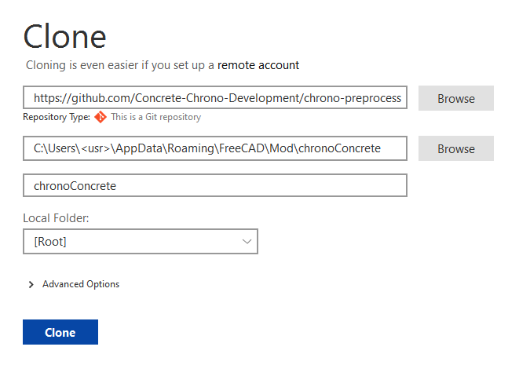

# 💻 Desktop Installation and Setup

Follow the below instructions to get set up with the Chrono Preprocessor. These instructions were written with Windows users in mind. It is also possible to install on Mac or Linux.

Please note the versions of each piece of software. Newer or alternate versions may work, but have not been tested and verified for compatibility.

Step 1: Install FreeCAD

Install the latest version of FreeCAD (use at least version 0.20.2). The download is available for free:

[https://www.freecadweb.org/downloads.php](https://www.freecadweb.org/downloads.php)

Step 2: Install Git Client

Any Git client can be used to push and pull from the GitHub. We recommend using SourceTree and these instructions will assume you are using that installation. You can download SourceTree for free here:

[https://www.sourcetreeapp.com/](https://www.sourcetreeapp.com/)

Step 3: Pull GitHub

We recommend pulling the GitHub directly into the FreeCAD workbench directory. Otherwise if you pull to another location then you will need to copy the pulled files to the appropriate directory.

* Open Sourcetree
* Select **File** > **Clone / New...**
* Select "**Remote**" and "**Add an account...**"
* For "Hosting Service" select "**GitHub**". For "Authentication" select "**OAuth**"
* Click on "**Refresh OAuth Token**" and login to GitHub and allow Sourcetree in the browser window that opens
* Click **Ok** in Sourcetree. Then "**chrono-preprocessor**" should populate on the right side of the window. If it doesn't, you may need to click refresh.
* Select "**chrono-preprocessor**" and click "**Clone**"
* When filling out the clone window, it should look like the image below (be sure you are naming it chronoConcrete), and with the appropriate username filled out instead of "**\<usr>**"
* Click "**Clone**"

<figure><figcaption></figcaption></figure>

Step 4: Test Installation

Verify that everything is installed properly by opening FreeCAD and check if the Chrono Workbench is available in the list of installed workbenches.

